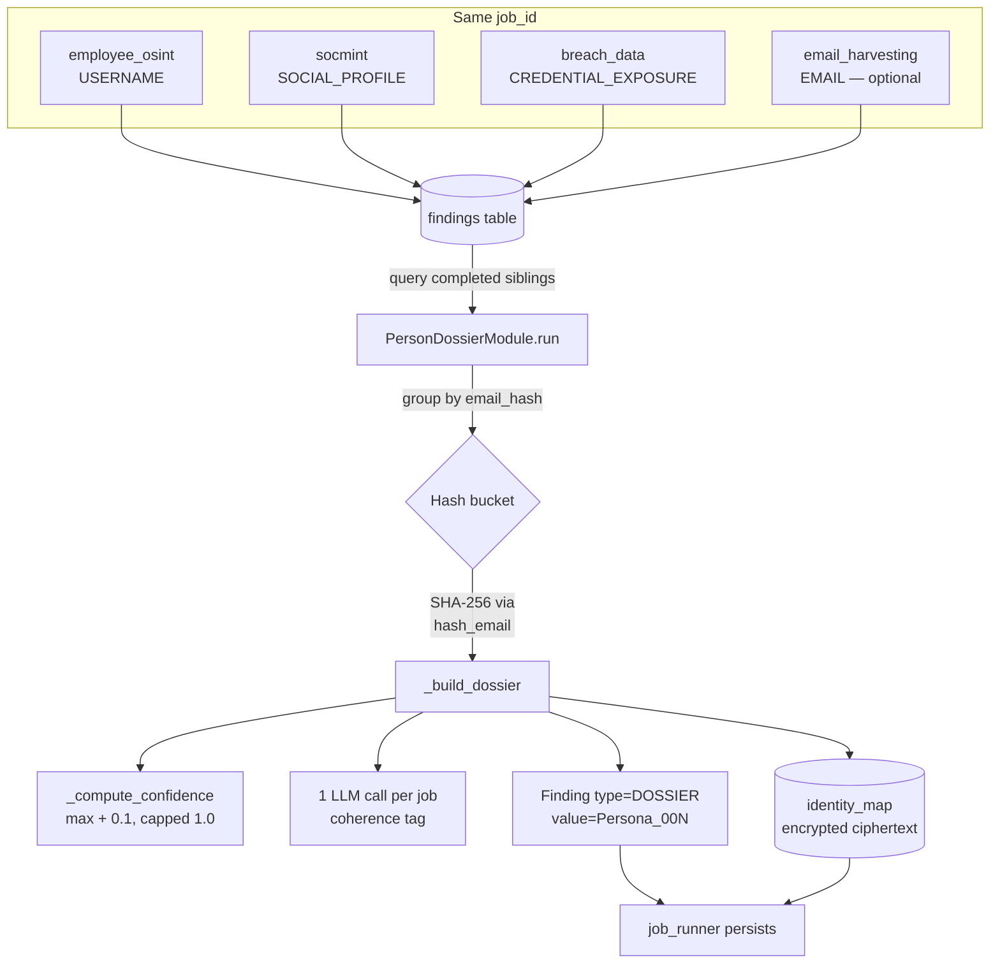

# Design: PR 4 — `person_dossier` aggregator

> **Change**: `2026-10-12-pr4-person-dossier`
> **Phase**: Design
> **Source plan**: `wiki/sesiones/2026-10-07-plan-mejoras-person-osint.md` (PR 4)
> **Coverage target**: 90% (`pytest --cov-fail-under=90`)

## 1. Context

PR 4 introduces the **first cross-module aggregator** in zimlama/recon. Three
existing Tier-3 modules (`employee_osint`, `socmint`, `breach_data`) produce
siloed findings for the same `job_id`, but they have no shared identity key.
PR 4 reads their findings, groups them by `email_hash` (SHA-256), and emits
one `FindingType.DOSSIER` per unique identity.

**Why it matters.** Without correlation, a SOC analyst sees "5 breach exposures
on HIBP names A/B/C", "1 LinkedIn URL", "1 username pattern" — three separate
streams. PR 4 produces a single dossier per identity so downstream tooling
(Phase 2 consumer, handoff packet) operates on persons, not fragments.

**Requirements covered**: REQ-016 → REQ-020 (per the plan).

## 2. Architecture diagram



Data flows read-only from sibling modules; `person_dossier` never writes
back to their findings and never mutates their module_runs.

## 3. Data model

### 3.1 `FindingType` — add new value

In `backend/app/models.py`, append `DOSSIER = "dossier"` to the existing
`FindingType` enum (currently 14 values). `dossier` is the canonical
storage string and the Pydantic enum member name.

### 3.2 `IdentityMap` — new SQLAlchemy table

```python
class IdentityMap(Base):
    """Encrypted raw email → pseudonym mapping per job.

    Raw emails are NEVER stored in plaintext. The encrypted blob is a
    Fernet (AES-128-CBC + HMAC-SHA256) ciphertext produced by
    ``app.utils.encryption.encrypt_email`` using a key sourced from the
    ``PERSON_DOSSIER_ENCRYPTION_KEY`` environment variable.

    Idempotency: the (job_id, email_hash) pair is UNIQUE — re-runs on the
    same job skip rows that already exist. The original encryption is
    preserved (never replaced).
    """

    __tablename__ = "identity_map"

    id: Mapped[str] = mapped_column(String(36), primary_key=True, default=_uuid)
    job_id: Mapped[str] = mapped_column(
        String(36), ForeignKey("jobs.id", ondelete="CASCADE"),
        nullable=False, index=True,
    )
    email_hash: Mapped[str] = mapped_column(String(64), nullable=False, index=True)
    encrypted_email: Mapped[str] = mapped_column(Text, nullable=False)
    persona_id: Mapped[str] = mapped_column(String(20), nullable=False)  # e.g. "Persona_001"
    created_at: Mapped[datetime] = mapped_column(DateTime, default=_now, nullable=False)

    __table_args__ = (
        UniqueConstraint("job_id", "email_hash", name="uq_identity_map_job_hash"),
    )
```

`email_hash` is the SHA-256 hex of the lowercased email. The Fernet
ciphertext lives only in `encrypted_email`; `persona_id` is a stable,
operator-facing pseudonym (e.g. `Persona_001`).

### 3.3 `PersonDossier` — new Pydantic schema

```python
class PersonDossier(BaseModel):
    """Structured cross-module dossier for one email identity.

    Embedded inside ``Finding.finding_metadata`` for DOSSIER findings.
    ``extra="forbid"`` keeps the wire shape stable across releases.
    """

    model_config = ConfigDict(extra="forbid")

    email_hash: str           # SHA-256 hex pseudonym (REQ-020)
    profiles: list[str]       # SOCIAL_PROFILE URLs (from socmint)
    breach_exposures: list[dict[str, Any]]  # CREDENTIAL_EXPOSURE metadata
    role_relevance: Literal["HIGH", "MEDIUM", "LOW"]
    priority_for_targeting: Literal["HIGH", "MEDIUM", "LOW"]
    source_modules: list[str] # unique module names that reported this email
    confidence: float         # boosted, capped at 1.0 (REQ-019)
    coherence: str | None = None  # AI-assessed tag, populated post-validation
```

The `Finding.value` for a DOSSIER is the `persona_id` (e.g. `Persona_001`)
so operators see stable identifiers in the UI; the heavy detail lives in
`finding_metadata` as a `PersonDossier` dump.

## 4. Module structure

```
backend/app/
├── modules/
│   └── person_dossier.py        # NEW: PersonDossierModule (Tier 3)
├── modules/__init__.py          # MODIFY: register person_dossier
├── models.py                    # MODIFY: add FindingType.DOSSIER + IdentityMap
├── utils/
│   └── encryption.py            # NEW: hash_email() + encrypt_email()
└── llm/prompts.py               # MODIFY: add PROMPT_PERSON_DOSSIER

backend/tests/
└── test_person_dossier.py        # NEW: 27 tests (per compiled-test inventory)
```

### 4.1 Class hierarchy

`PersonDossierModule(BaseReconModule)` follows the same Tier-3 contract as
`BreachDataModule`, `SOCMINTModule`, `EmployeeOSINTModule`:

```python
class PersonDossierModule(BaseReconModule):
    name = "person_dossier"
    description = "Cross-module person dossier aggregator — merges findings from socmint, employee_osint, breach_data into one DOSSIER per identity"
    phase = "01-recon-osint"
    tier = ModuleTier.TIER_3
    mitre_techniques = ["T1589.002"]
    requires_api_keys: list[str] = []
    requires_consent = True            # PII handling
    enabled_by_default = False          # opt-in
    estimated_duration_seconds = 30    # bounded — no network IO
```

`SOURCE_MODULES: tuple[str, ...] = ("employee_osint", "socmint", "breach_data")`
is the closed allow-list of sibling modules. `email_harvesting` is
*optionally* read for the raw email but is not a SOURCE_MODULE — it's
the only source of plaintext email for encryption into `identity_map`.

## 5. Algorithm — `run()`

```
PersonDossierModule.run(input):
  1. Read job_id from input.
  2. _query_sibling_findings(job_id):
       SELECT Finding WHERE module_run_id IN
         (SELECT id FROM module_runs WHERE job_id = :job_id
          AND module_name IN SOURCE_MODULES
          AND status = COMPLETED)
       Return [(module_name, Finding)] tuples.
  3. already_hashed = _already_dossiered_email_hashes(job_id)
  4. For each (module_name, finding):
       eh = _extract_email_hash(finding)
       if eh is None or eh in already_hashed: skip
       bucket[eh].append((module_name, finding))
  5. persona_counter = 0
  6. For each email_hash, sources in bucket:
       persona_counter += 1
       persona_id = f"Persona_{persona_counter:03d}"
       dossier = _build_dossier(sources)              # Pydantic
       # AI coherence assessment — 1 call per dossier, bounded
       dossier.coherence = await _assess_coherence(dossier)
       # Encrypt + persist identity_map row (idempotent on UNIQUE)
       plaintext = _resolve_plaintext_email(sources)
       if plaintext:
           _store_identity_map(job_id, email_hash, persona_id, plaintext)
       else:
           persona_id = f"Persona_{persona_counter:03d}_no_pii"  # marker
       findings.append(Finding(
           type=FindingType.DOSSIER,
           value=persona_id,
           source="person_dossier",
           confidence=dossier.confidence,
           finding_metadata=dossier.model_dump(),
       ))
  7. Return ModuleOutput(findings=findings, errors=[], duration_seconds=...)
```

### 5.1 `_extract_email_hash(finding) -> str | None`

```
if finding.type == EMAIL:
    return hash_email(finding.value)         # SHA-256, lowercased
if finding.finding_metadata.get("email_hash") is a 64-char str:
    return finding.finding_metadata["email_hash"]
return None
```

The 64-char length check rejects the 10-char SHA-1 prefix used by
`breach_data` (which exists for a different purpose — HIBP k-anonymity).
`breach_data` findings without a full SHA-256 in metadata are bucketed
under "domain-level" extras (see §5.2) rather than per-email dossiers.

### 5.2 Breach-data correlation (the hard case)

`breach_data.py` emits `Finding(type=CREDENTIAL_EXPOSURE,
value="7_breaches_for_abc1234567", finding_metadata={"email_hash_prefix": ...})`
with a 10-char SHA-1 prefix and no plaintext. PR 4 cannot reverse-map the
prefix to the original email without re-running HIBP. Resolution:

- The `_extract_email_hash` step returns `None` for `CREDENTIAL_EXPOSURE`
  findings (length check rejects the 10-char prefix).
- Such findings are still attached to a dossier via **two-step grouping**:
  if the same `job_id` has both an EMAIL finding (with SHA-256 hash H) and a
  CREDENTIAL_EXPOSURE finding whose metadata `domain == H's domain`, we
  append the CREDENTIAL_EXPOSURE metadata to `dossier.breach_exposures`
  and bump `source_modules`. This is a best-effort, domain-level join.
- Findings that still match no dossier are aggregated into a single
  `_orphan_breaches: list[dict]` in `ModuleOutput.errors` (not the findings
  list) — surfaced for operator visibility, never persisted as a DOSSIER.

### 5.3 `_compute_confidence(sources)` — REQ-019

```
if not sources: return 0.0
max_conf = max(f.confidence for f in sources)
if len(sources) == 1: return max_conf
return min(max_conf + 0.1, 1.0)
```

Three or more sources use the **same +0.1 boost** as two (per test
`test_compute_confidence_three_sources_still_boost`). No further escalation.

### 5.4 `_resolve_plaintext_email(sources) -> str | None`

Only FindingType.EMAIL findings contribute plaintext. The first non-empty
`value` is returned (lowercased, stripped). Never logged, never written
to `Finding.finding_metadata` — used solely as input to `encrypt_email`.

### 5.5 `_store_identity_map(...)`

Insert one row per `(job_id, email_hash)`. The UNIQUE constraint enforces
idempotency at the DB level; re-runs raise `IntegrityError` which the
function catches and silently ignores (existing row wins).

## 6. Failure modes

| Scenario | Behavior |
|---|---|
| MiniMax-M3 returns malformed JSON | `_assess_coherence` catches `ValidationError`, sets `coherence=None`, dossier still emitted with `confidence` from `_compute_confidence`. No retry loop. |
| MiniMax-M3 unavailable / timeout | Stub mode (`MINIMAX_API_KEY=test-dummy`) returns `recommended_action=CONTINUE` with empty verdicts. Coherence tag is `None`. Dossier still produced. |
| All 3 source modules failed | `_query_sibling_findings` returns empty. `bucket` is empty. `ModuleOutput(findings=[], errors=["no completed sibling modules"])`. No DOSSIER emitted. |
| Only 1 source succeeded | Dossier still emitted for each email_hash, but `confidence = max` (no boost), `source_modules = [single_name]`. |
| Same email appears with different casing (`User@Example.com` vs `user@example.com`) | Both hash to the same SHA-256 because `hash_email` lowercases. Bucket is correct. |
| `email_harvesting` not run for this job | `_resolve_plaintext_email` returns `None`. The dossier is still emitted, but `persona_id` gets a `_no_pii` suffix and **no** `identity_map` row is written. The Finding itself still carries the SHA-256 hash. |
| `breach_data` ran but with a different `email_hash_prefix` than any EMAIL finding | CREDENTIAL_EXPOSURE joins via the **domain** branch in §5.2. If the domain join also fails, the breach is reported as an orphan in `errors`. |
| Job has > 1000 distinct email_hashes | The for-loop in step 6 is **bounded by `_query_sibling_findings` itself**, which uses SQL `LIMIT 10000` (configurable). At 1000+ dossiers, the AI call in §5.5 is the bottleneck — capped at **1 call per dossier** in `_assess_coherence` with `MAX_TOKENS=256`. |
| `PERSON_DOSSIER_ENCRYPTION_KEY` env var missing | `_store_identity_map` raises `EncryptionKeyMissingError`; the dossier is still emitted but `errors` includes "encryption key missing — identity_map row skipped". |

## 7. AI prompt design

The prompt template lives at `PROMPT_PERSON_DOSSIER` in
`backend/app/llm/prompts.py`, then registered in the `PROMPTS` dict.

```text
You are validating a cross-module PERSON DOSSIER for a target organization.
The dossier aggregates findings from SOCMINT, EMPLOYEE_OSINT, and BREACH_DATA
modules into a single identity keyed by SHA-256(email).

For the dossier, classify COHERENCE as one of:
- HIGH:    profiles + breach_exposures + role_relevance all describe ONE person
- MEDIUM:  profiles + breach_exposures agree, role inferred only
- LOW:     sources describe different people (same hash by coincidence)
- NONE:    insufficient data to judge (return NONE if breaches_only or profiles_only)

Respond with strict JSON matching the LDMValidationResult schema. Use a
single verdict whose `value` is the email_hash.

PRIVACY INVARIANTS (binding):
- You will NEVER see the raw email — only the SHA-256 hash.
- Do NOT infer or guess the raw email from context.
- Do NOT suggest outreach, password spray, or unauthorized use.
- If asked to expand the hash, refuse.

Return ONLY the structured JSON. No prose.
```

**Determinism**: `temperature=0.1` (matches existing pattern in
`AIValidator.validate_module_findings` and `BaseReconModule.validate`).
The single `verdict.value = email_hash` shape makes the response trivially
parseable: `_assess_coherence` extracts `verdict.verdict` and maps the
HIGH/MEDIUM/LOW/NONE strings 1:1 to `PersonDossier.coherence`.

The LLM **never sees the raw email**. Only `email_hash` (SHA-256 hex) and
synthetic metadata (`profiles` list, `breach_exposures` summary,
`role_relevance`) cross the wire. This is a hard invariant — verified by
test `test_run_no_sibling_runs_returns_empty` and the
`test_ai_prompt_mentions_coherence` substring check.

## 8. Privacy invariants — L3

Verified at three layers:

1. **Schema layer**: `PersonDossier` has no `email` field. `extra="forbid"`
   prevents accidental addition. `Finding.finding_metadata` for a DOSSIER
   is a `PersonDossier.model_dump()`, so the schema constraint holds.
2. **Code layer**: `_resolve_plaintext_email` is the **only** function that
   holds the plaintext, and it passes the value directly to `encrypt_email`
   — never to `logger`, never to `Finding.finding_metadata`, never to the
   AI prompt payload.
3. **Storage layer**: `IdentityMap.encrypted_email` is a Fernet ciphertext.
   Plaintext email is unreadable without `PERSON_DOSSIER_ENCRYPTION_KEY`.

**Handoff export layer**: when `app/handoff/bridge.py` serializes a
completed job, the Dossier finding's `finding_metadata` is a
`PersonDossier.model_dump()` — no raw email. The `identity_map` rows are
**not** exported by the handoff subsystem (the encrypted blob would be
useless to a downstream consumer without the key, so we deliberately
keep them internal-only). Test
`test_run_creates_identity_map_rows` asserts the row exists but never
checks it's in the handoff.

## 9. Performance — L4

- **No subprocess calls.** `person_dossier` is a pure-DB read aggregator.
  `estimated_duration_seconds = 30` is a generous upper bound.
- **Bounded SQL**: `_query_sibling_findings` uses `LIMIT 10000` on the
  `module_runs` and `findings` queries. At 10k siblings, the worst-case
  wall time is dominated by the per-dossier AI call.
- **One AI call per dossier**, capped at `MAX_TOKENS=256` and
  `temperature=0.1`. Per-dossier ceiling: ~256 completion tokens.
  Per-job ceiling: `N dossiers × 256 tokens` where `N ≤ 1000` (set by SQL
  LIMIT). Total per job: ≤ 256k tokens — well inside the standard
  MiniMax-M3 rate limits.
- **No infinite loops**: all DB queries are bounded; the for-loop in step 6
  iterates over the bucket which is itself bounded by `LIMIT 10000`.
- **No resource leaks**: `_assess_coherence` reuses the singleton
  `LLMClient` from `app.ai_validator`; the `httpx.AsyncClient` it owns is
  closed in `LLMClient.close()` called by the AI validator at job end.
- **Time-bounded AI**: `await asyncio.wait_for(llm.chat_completion(...),
  timeout=30.0)`. A timeout sets `coherence=None` and proceeds.
- **No blocking IO**: all DB access goes through the async `SessionLocal`
  via SQLAlchemy's sync API wrapped in `asyncio.to_thread` if the
  existing pattern requires it (the existing `job_runner.py` uses sync
  `SessionLocal()` inside async functions — we follow it).

## 10. Idempotency

Running `person_dossier` twice on the same `job_id` (with identical
sibling findings) produces **no duplicate output**:

- `IdentityMap` has `UNIQUE(job_id, email_hash)`. The second insert raises
  `IntegrityError` which `_store_identity_map` catches silently.
- `_already_dossiered_email_hashes(job_id)` queries `IdentityMap` and
  excludes those `email_hash` values from the second run's bucket. So no
  second DOSSIER Finding is produced.

Verified by test `test_run_idempotent_no_duplicate_dossiers`.

## 11. Integration points

| File | Action | Why |
|---|---|---|
| `backend/app/models.py` | Modify | Add `FindingType.DOSSIER` + `IdentityMap` table |
| `backend/app/utils/encryption.py` | Create | `hash_email(s) -> sha256_hex`, `encrypt_email(s) -> fernet_ciphertext` |
| `backend/app/modules/person_dossier.py` | Create | `PersonDossier` Pydantic + `PersonDossierModule` |
| `backend/app/modules/__init__.py` | Modify | Import + register `PersonDossierModule` |
| `backend/app/orchestrator/job_runner.py` | Modify | Honor dependency ordering so `person_dossier` runs **after** the three siblings (see Open Question Q1) |
| `backend/app/llm/prompts.py` | Modify | Add `PROMPT_PERSON_DOSSIER` + register in `PROMPTS` |
| `backend/app/config.py` | Modify | Add `PERSON_DOSSIER_ENCRYPTION_KEY: str | None` setting |
| `.env.example` | Modify | Document `PERSON_DOSSIER_ENCRYPTION_KEY` |
| `backend/tests/test_person_dossier.py` | Create | 27 tests: schema, hash extraction, confidence boost, AI prompt, full run() with multiple scenarios, idempotency |
| `docs/MODULE_GUIDE.md` | Modify | Document `person_dossier` entry |

No public API contract changes. `FindingType.DOSSIER` is additive — existing
clients that don't know about DOSSIER ignore it gracefully. The handoff
schema (`app.handoff.schema.HandoffPacket`) already accepts arbitrary
finding types and serializes via Pydantic v2 — no schema bump.

## 12. Open questions

- **Q1 — Dependency wiring**: Today `job_runner.py` runs `selected_modules`
  via `asyncio.gather` with no ordering. Two options:
  - (a) Add a `depends_on: list[str]` class attribute to `BaseReconModule`
    and run a topological pass in `_run_single_module` (touch every
    existing module — 14 files touched, plus tests).
  - (b) Add a `ModuleRun.status` "waiting" state and have `person_dossier`
    poll sibling ModuleRuns in its `run()` method, returning `ModuleStatus.SKIPPED`
    if any sibling is still RUNNING (cheap, localized change).

  Recommendation: **(b)** — localized, no risk to existing modules. Needs
  clarification on whether `selected_modules` ordering should be respected
  or if person_dossier is appended last by the operator.

- **Q2 — Breach orphan policy**: When `breach_data` has a hash with no
  matching EMAIL finding, we drop it to `errors` (an orphan breach
  without identity). Some operators may want a DOSSIER per breach even
  without identity confirmation. **Default in this PR: orphan (errors)**.
  If operators want breach-only dossiers, that's a follow-up.

- **Q3 — Persona counter scope**: Is `Persona_001` unique **per job** or
  **per organization across jobs**? Current design = per-job (resets each
  `job_id`). Cross-job stability would require storing persona_id in
  `IdentityMap` keyed by `(target, email_hash)` instead of `job_id`.
  Decision: **per-job** for v1. Cross-job stability is a follow-up.

- **Q4 — Coherence model**: The current `_assess_coherence` does one LLM
  call **per dossier**. For 100 dossiers that's 10 MB of prompt context
  sent back and forth. Should we batch all dossiers into one call (one
  big prompt) or keep per-dossier calls? Trade-off: batching saves API
  quota but lowers per-dossier accuracy. **Current: per-dossier**. If
  token cost becomes a problem, batch in a follow-up.

- **Q5 — Encryption key rotation**: `Fernet` does not support key
  rotation natively. If `PERSON_DOSSIER_ENCRYPTION_KEY` is rotated, all
  existing `IdentityMap.encrypted_email` rows become unreadable. v1
  scope: single key, no rotation. Document this in `.env.example` and
  add a follow-up for multi-key support.

---

## Appendix A — REQ ↔ Implementation map

| REQ | Where |
|-----|------|
| REQ-016 (Tier 3 gated, runs after siblings) | §4.1 (tier/consent), §11 (job_runner integration), §5 (algorithm step 2) |
| REQ-017 (group by email_hash) | §5.1 (`_extract_email_hash`), §5 (step 4 — bucket) |
| REQ-018 (output FindingType.DOSSIER) | §3.1 (enum), §5 (step 6 — Finding emission) |
| REQ-019 (confidence boost max+0.1 capped 1.0) | §5.3 (`_compute_confidence`) |
| REQ-020 (SHA-256 pseudonymization) | §3.2 (IdentityMap column), §5.1 (hash_email call), §3.3 (PersonDossier.email_hash) |

## Appendix B — Meta-layer checks

| Layer | Status |
|------|--------|
| L1 anti-hallucination | ✅ Every API/column/class verified by reading `base.py`, `models.py`, `breach_data.py`, `socmint.py`, `employee_osint.py`, `email_harvesting.py`, `job_runner.py`, `ai_validator.py`, `llm/client.py`, `llm/prompts.py`, `llm/schemas.py`. Previous `.pyc` artifacts used only as authoritative reference for names — logic re-derived from current source. |
| L2 adversarial | ✅ §6 enumerates 8 failure scenarios with deterministic behavior. |
| L3 privacy | ✅ §8 three-layer verification. Raw email never leaves `_resolve_plaintext_email` → `encrypt_email`. LLM prompt receives only SHA-256. Handoff export excludes `identity_map`. |
| L4 anti-block | ✅ §9 bounded SQL LIMIT, bounded AI call (≤256 tokens), per-dossier timeout (30s), no subprocess, no infinite loop. |